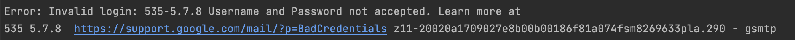

# CS3219-AY22-23-Project-Group37

This is the repository for CS3219 project, Peerprep.

## Pre-requisites for local:

1. Create an account and set up database in [MongoDB Atlas](https://www.mongodb.com/atlas/database)
2. [MongoDB Compass](https://www.mongodb.com/products/compass) (Optional)
3. [Nodejs](https://nodejs.org/en/) v18++
4. [Docker](https://www.docker.com)
5. Gmail account
6. [Postman](https://www.postman.com/downloads/)

## Setup Local environment:

### User Service

1. Go into `user-service` directory
2. Rename .env.sample file to .env
3. Create a Cloud DB URL using Mongo Atlas
4. Enter the DB URL created as `DB_LOCAL_URI` in `.env` file
5. Enter the JWT secret key as `JWT_SECRET_KEY` in `.env` file (can be obtained from running `node -e "console.log(require('crypto').randomBytes(256).toString('base64'));"`)
6. Create [App Password](https://myaccount.google.com/apppasswords?rapt=AEjHL4PZB2jtGe1EVQ1dS_jyte5bhU_hn44yc3rDR0k3BnmcIqzmocSf5sBDIN88P8vB7-owMYAWLK6m37OyA-_2C6IE7qapTg) and save the passcode generated
7. Enter your gmail as `USERNAME` and passcode as `PASSWORD` in `.env` file
8. Install npm packages using `npm i`
9. Run User Service using `npm run dev` at the `user-service` directory

**Note**: To ensure that the email feature is working, run in Postman a `POST` request for API `http://localhost:8000/api/user/signup` with body:
```json
{
  "email": "test1@u.nus.edu",
  "username": "test1",
  "password": "Test1@u.nus.edu"
}
```
If an error of Invalid login is seen:



Change `USERNAME` and `PASSWORD` in the `.env` file to `USER` and `PASS` respectively. Similarly, change any `USERNAME` and `PASSWORD` in `email.js` file under `utils` directory to `USER` AND `PASS` respectively

**Note**: If [Docker](#using-docker) is used, change `PORT` in `.env` file to 80, otherwise, `PORT` will be 8000

### Matching Service
1. Go into `matching-service` directory
2. Install npm packages using `npm i`.
3. Run Matching service using `npm run dev`.

### Collaboration Service
1. Go into `collab-service` directory
2. Install npm packages using `npm i`.
3. Run Collaboration service using `npm run dev`.

### Question Service
1. Go into `question-serivce` directory
2. Rename `.env.sample` file to `.env`
3. Create a Cloud DB URL using Mongo Atlas
4. Enter the DB URL created as `DB_LOCAL_URI` in `.env` file
5. Under `question-service/test`, import `data.json` file into MongoDB (can be done easily through MongoDB Compass)
6. Install npm packages using `npm i`
7. Run Question Service using `npm run dev` at the question-service directory

**Note**: When importing `data.json` file into MongoDB, ensure that the database name that the file is being 
imported into matches the database as specified in the `DB_LOCAL_URI`. Ensure that there is also a collection in the database 
named as `questionmodels`, otherwise, create the collection

### Chat Service
1. Go into `communication-service` directory
2. Install npm packages using `npm i`
3. Run Chat Service using `npm run dev`. 

### Frontend
1. Go into `frontend` directory
2. In the `configs.js` and `Socket.js` files, uncomment the lines within the 'For usage *without* Docker' section, and comment out
the lines within the 'For usage with Docker section
3. Install npm packages using `npm i`
4. Run Frontend using `npm start`

## Using Docker:
Docker is used to deploy the app to the local staging environment, and it helps simplify the process by running all services at once
instead of starting them up one by one 

To run docker at the root folder: run `DOCKER_BUILDKIT=1 docker-compose up --build -d`

After running the command, check that there should be 8 containers that are created and started under `cs3219-project-ay2223s1-g37` main container

Go to `http://localhost:80` to start using the app

**Note**: Before running docker, go into the `frontend` directory and ensure that the correct lines are commented out in the `configs.js` and `Socket.js` files.
The lines within the 'For usage *with* Docker' section should be uncommented, and the lines within the 'For usage without Docker' section should be commented out.

## Notes:
1. Make sure that PORT 80, 8000, 8001, 8002, 8003 and 8004 is not used when running Docker or when manually starting each service
